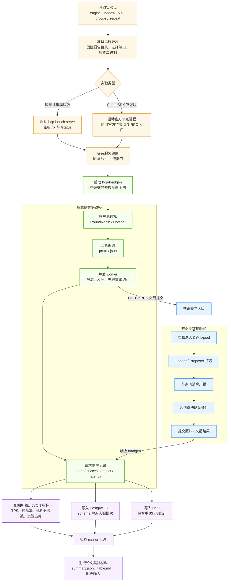
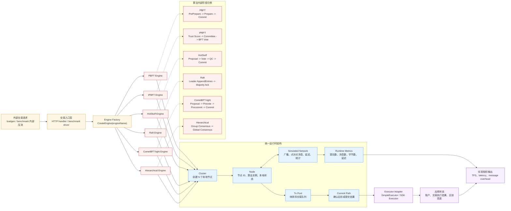
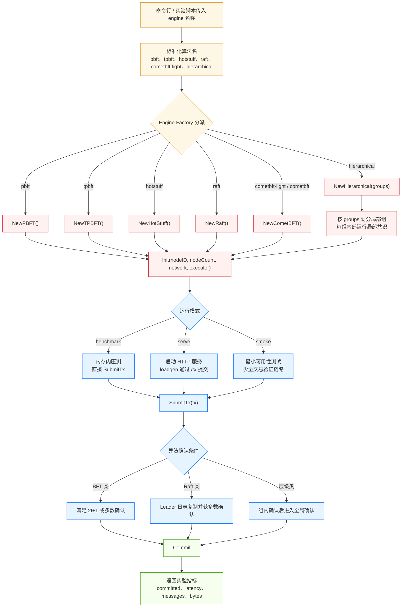
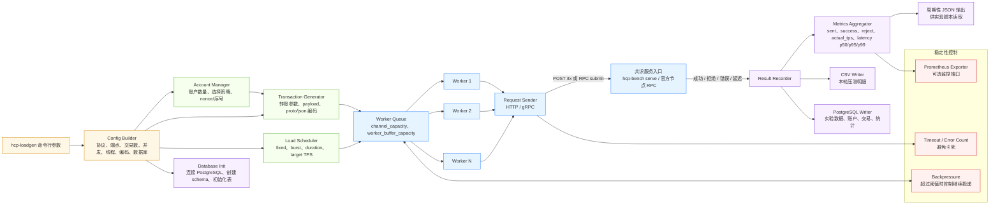
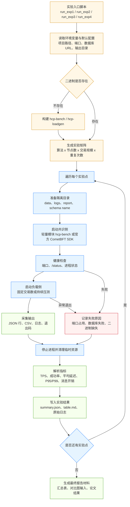
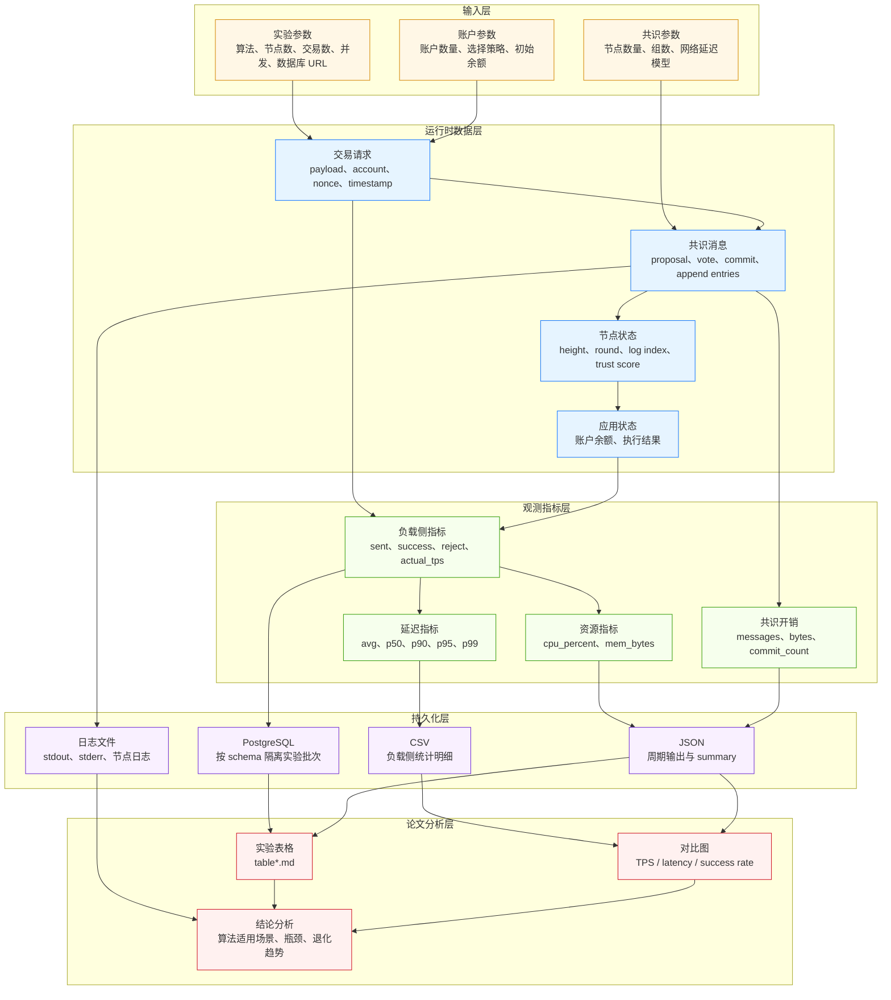
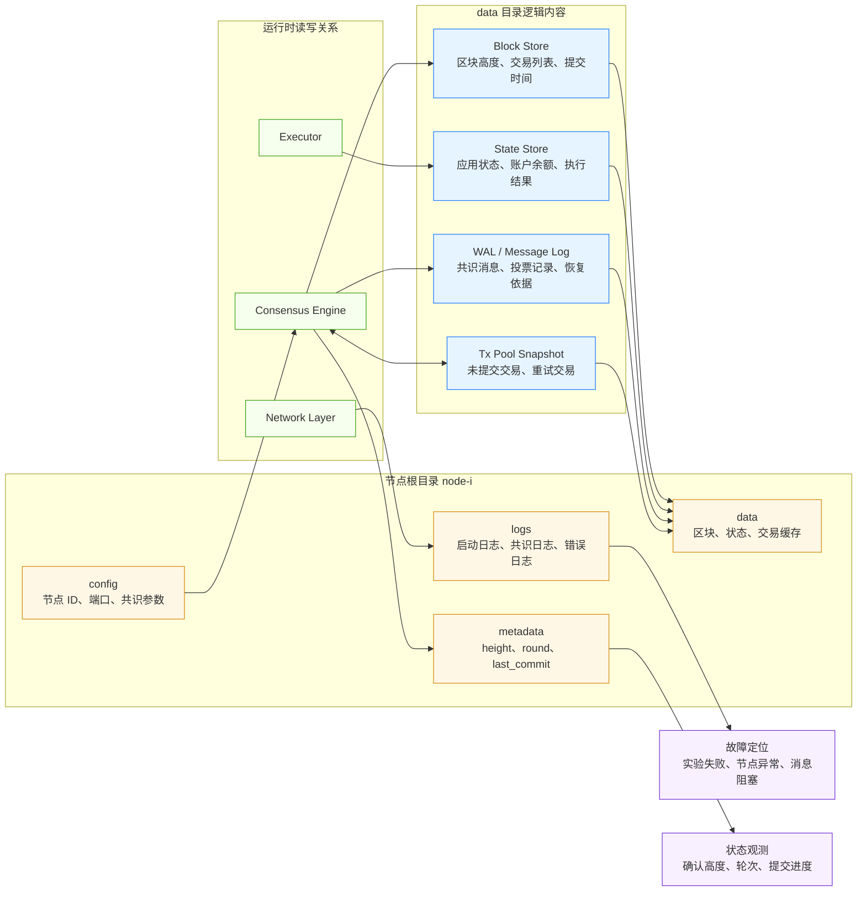
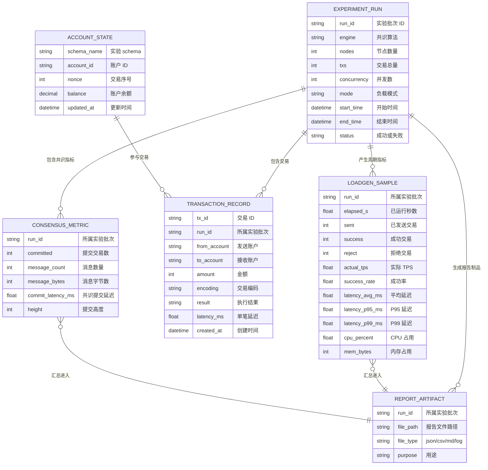

# 第四章架构图 Mermaid 参考稿

本目录只存放论文第四章架构图的 Mermaid 源稿，用于后续手工重画参考；不参与任何实验运行，也不修改现有代码。

建议对应关系：

- 图 4-1：HCP-Bench 总体架构
- 图 4-2：单轮实验数据流
- 图 4-3：共识执行子系统
- 图 4-4：引擎选择与执行路径
- 图 4-5：负载生成子系统
- 图 4-6：实验编排子系统
- 图 4-7：数据层次与流向
- 图 4-8：区块链节点本地存储
- 图 4-9：系统实验数据存储

手工绘制时可以把每个 `subgraph` 当成一个模块边界，把箭头文字作为论文图中的流程说明。

## 图 4-1 HCP-Bench 总体架构

```mermaid
flowchart LR
  U["实验使用者 / 论文实验入口"]

  subgraph Lab["实验编排层 hcp-lab"]
    L1["实验脚本<br/>run_exp*.sh / run_*.ps1"]
    L2["公共运行器<br/>common_runner / common_engine_runner"]
    L3["实验矩阵<br/>算法、节点数、交易数、重复次数"]
    L4["结果整理<br/>summary.json / table*.md / csv"]
  end

  subgraph Loadgen["负载生成层 hcp-loadgen"]
    G1["命令行参数解析<br/>protocol、endpoint、mode、total-txs"]
    G2["交易构造<br/>账户选择、交易编码、签名/序列化"]
    G3["并发调度<br/>worker threads、concurrency、backpressure"]
    G4["提交客户端<br/>HTTP / gRPC"]
    G5["指标采集<br/>TPS、成功率、延迟分位数、CPU、内存"]
    G6["负载侧持久化<br/>PostgreSQL schema、CSV"]
  end

  subgraph Bench["共识实验服务层 hcp-consensus / hcp-bench"]
    B1["hcp-bench CLI<br/>benchmark / serve / smoke"]
    B2["HTTP 交易入口<br/>/tx、/status"]
    B3["Engine Factory<br/>按算法名创建共识引擎"]
    B4["Cluster / Node<br/>本地多节点模拟集群"]
    B5["Simulated Network<br/>消息投递、延迟、统计"]
    B6["Executor Adapter<br/>提交后执行交易"]
  end

  subgraph Engines["共识算法层"]
    E1["PBFT<br/>pre-prepare / prepare / commit"]
    E2["tPBFT<br/>信任评分 + 委员会 + BFT确认"]
    E3["HotStuff<br/>QC 链式确认"]
    E4["Raft<br/>Leader 日志复制"]
    E5["CometBFT-light<br/>propose / prevote / precommit"]
    E6["Hierarchical<br/>分组共识 + 全局汇聚"]
    E7["CometBFT 官方版<br/>独立工程基线"]
  end

  subgraph Store["数据与制品层"]
    S1["节点运行目录<br/>node data / logs"]
    S2["实验报告目录<br/>report / summary / markdown"]
    S3["PostgreSQL<br/>loadgendata / public / per-schema"]
    S4["论文图表输入<br/>JSON、CSV、Markdown 表格"]
  end

  U --> L1
  L1 --> L2
  L2 --> L3
  L2 --> B1
  L2 --> G1
  G1 --> G2 --> G3 --> G4
  G4 -- "交易请求" --> B2
  B1 --> B2
  B2 --> B3 --> B4
  B4 --> B5
  B4 --> Engines
  Engines --> B6
  B6 -- "提交结果" --> B2
  B2 -- "响应延迟 / 成功失败" --> G5
  G5 --> G6
  B4 --> S1
  G6 --> S3
  L4 --> S2
  S2 --> S4
  S3 --> S4

  classDef user fill:#fff7e6,stroke:#d48806,color:#262626;
  classDef lab fill:#f9f0ff,stroke:#722ed1,color:#262626;
  classDef load fill:#f6ffed,stroke:#389e0d,color:#262626;
  classDef bench fill:#e6f4ff,stroke:#1677ff,color:#262626;
  classDef engine fill:#fff1f0,stroke:#cf1322,color:#262626;
  classDef store fill:#f5f5f5,stroke:#595959,color:#262626;
  class U user;
  class L1,L2,L3,L4 lab;
  class G1,G2,G3,G4,G5,G6 load;
  class B1,B2,B3,B4,B5,B6 bench;
  class E1,E2,E3,E4,E5,E6,E7 engine;
  class S1,S2,S3,S4 store;
```

## 图 4-2 单轮实验数据流

## 图 4-3 共识执行子系统

## 图 4-4 引擎选择与执行路径

## 图 4-5 负载生成子系统

## 图 4-6 实验编排子系统

## 图 4-7 数据层次与流向

## 图 4-8 区块链节点本地存储

## 图 4-9 系统实验数据存储

## 论文手绘拆分建议

如果图太密，可以拆成两类：

- 第四章系统设计：优先使用图 4-1、4-3、4-4、4-5、4-6。
- 第四章数据设计：优先使用图 4-2、4-7、4-8、4-9。

答辩讲解时可以按“实验脚本发起、loadgen 造交易、共识引擎排序、执行器提交、数据库和报告归档”这一条主线串起来。
