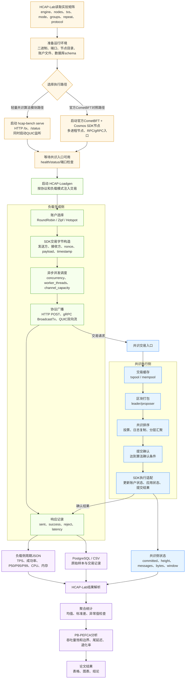
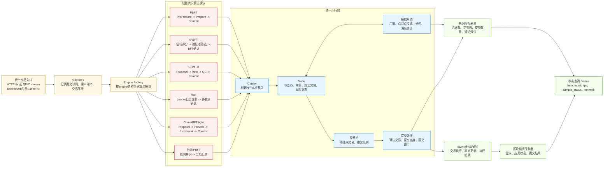
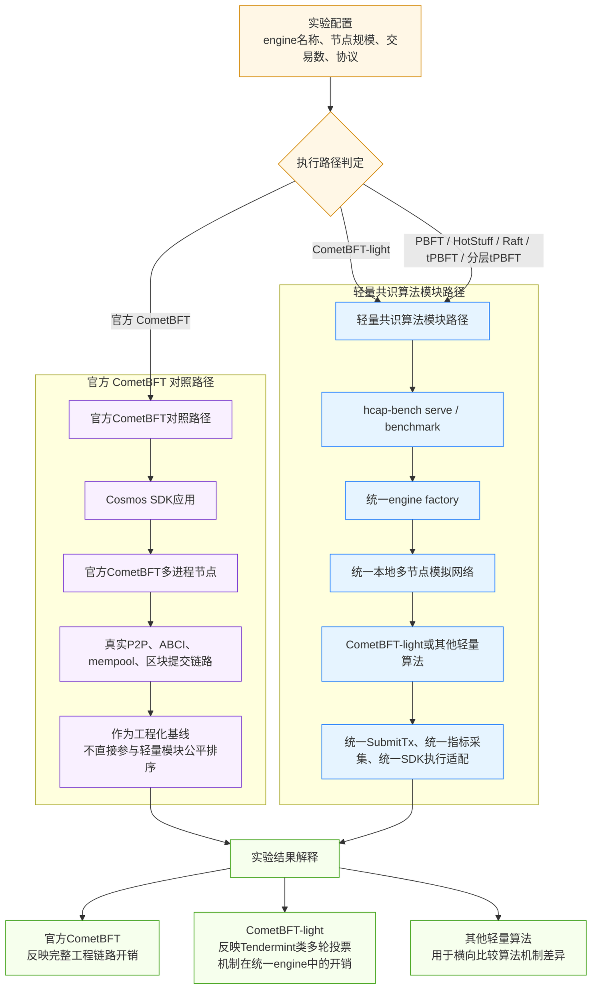
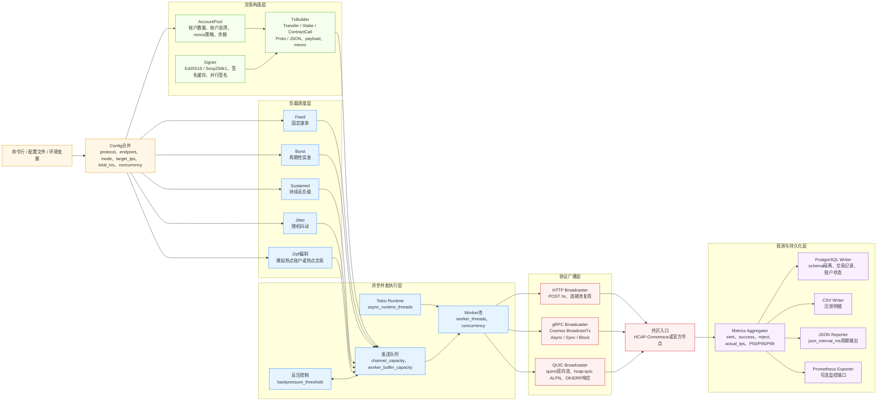
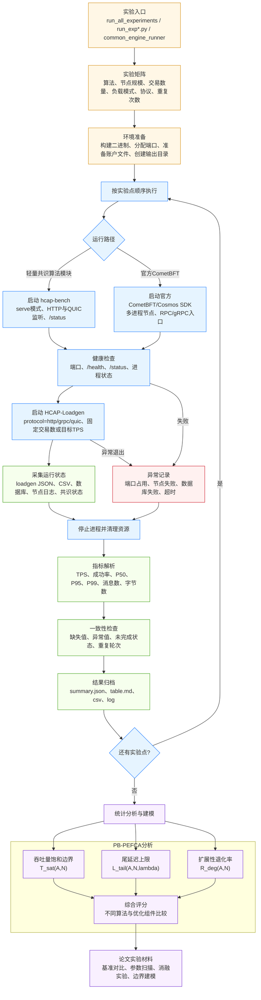
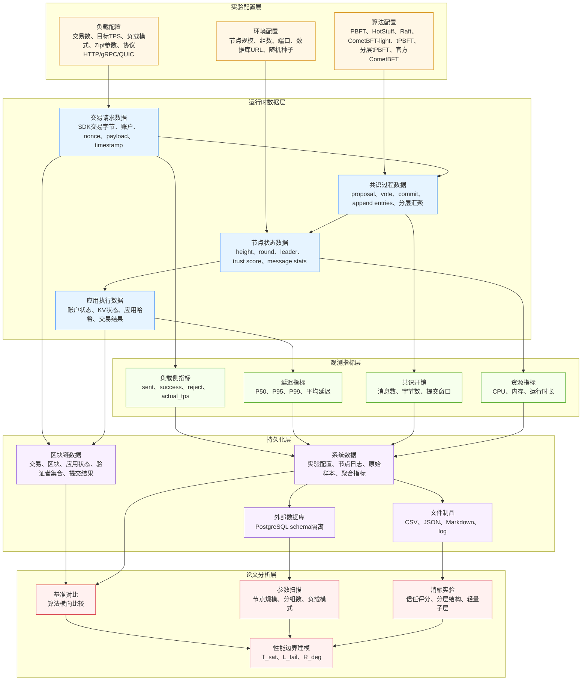
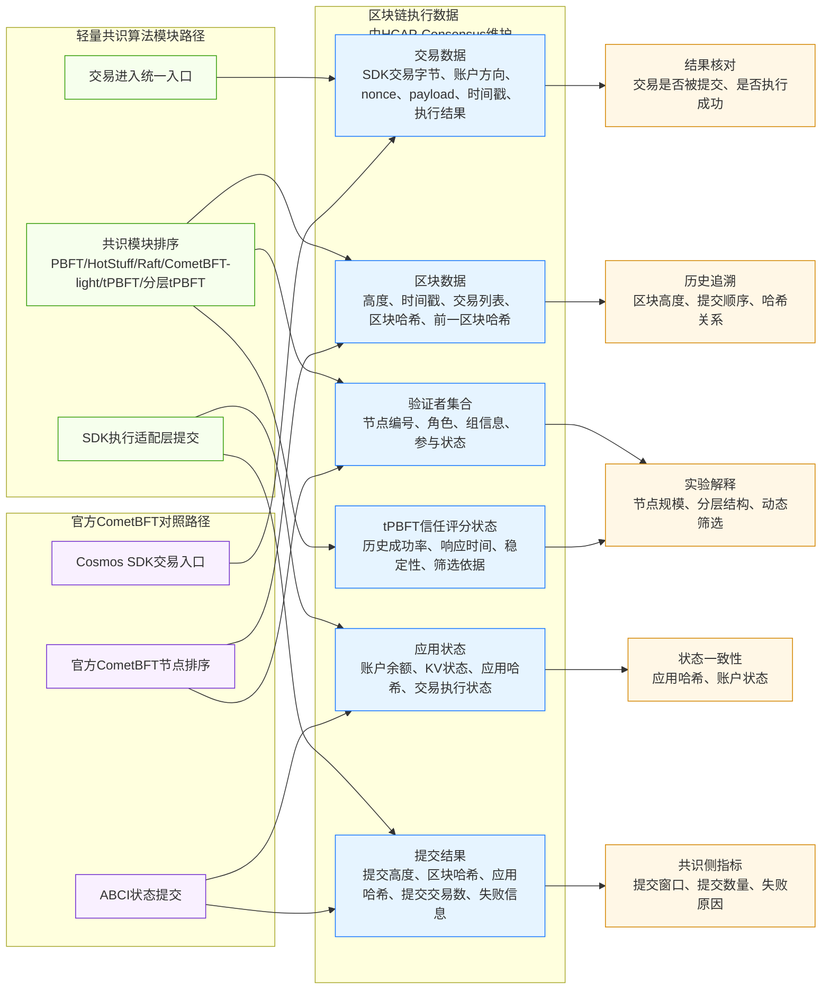
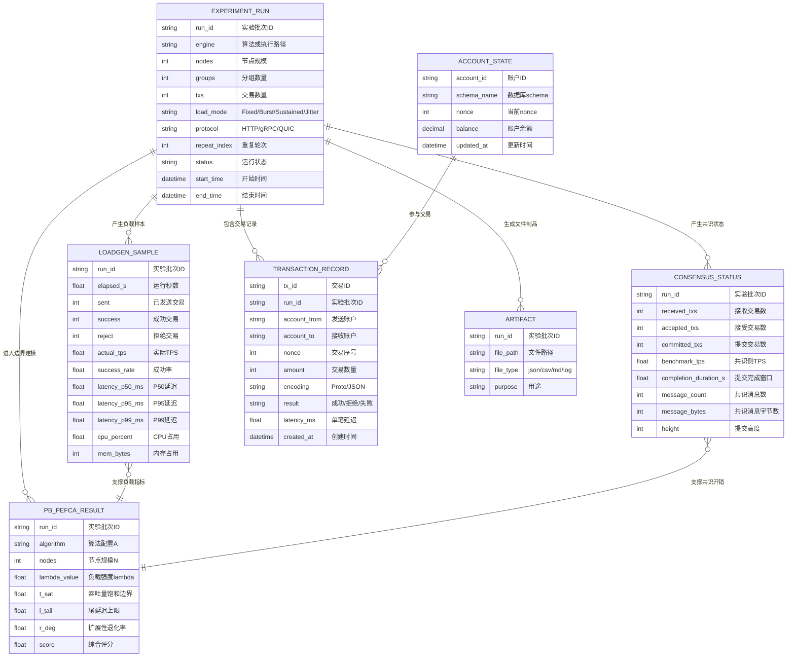
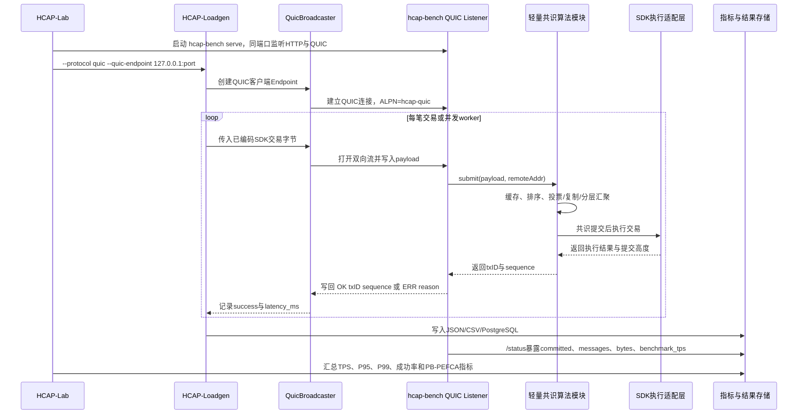

# 第四章架构图 Mermaid 参考稿

本目录只存放论文第四章架构图的 Mermaid 源稿，用于后续手工重画参考；不参与实验运行，也不修改现有代码。

本版按当前论文正文口径重新整理，关键词统一为：

- 平台名称：`HCAP-Bench`
- 三个子系统：`HCAP-Consensus`、`HCAP-Loadgen`、`HCAP-Lab`
- 方法名称：`PB-PEFCA`
- 两类共识执行路径：`轻量共识算法模块路径` 与 `官方 CometBFT 对照路径`
- 轻量算法集合：`PBFT`、`HotStuff`、`Raft`、`CometBFT-light`、`tPBFT`、`分层 tPBFT`
- 负载提交协议：`HTTP`、`gRPC`、`QUIC`
- 核心指标：`TPS`、`P50`、`P95`、`P99`、`成功率`、`消息数`、`字节数`、`吞吐量饱和边界`、`尾延迟退化`、`扩展性退化率`

建议图号对应：

- 图 4-1：HCAP-Bench 总体架构
- 图 4-2：端到端实验数据流
- 图 4-3：HCAP-Consensus 共识引擎子系统
- 图 4-4：官方 CometBFT 与 CometBFT-light 执行路径差异
- 图 4-5：HCAP-Loadgen 高并发负载生成子系统
- 图 4-6：HCAP-Lab 实验编排与 PB-PEFCA 分析子系统
- 图 4-7：HCAP-Bench 数据分层流转
- 图 4-8：区块链执行数据存储
- 图 4-9：系统实验数据存储
- 补充图：QUIC 并发提交路径细化图，可并入图 4-5

## 图 4-1 HCAP-Bench 总体架构

```mermaid
flowchart LR
  User["实验研究者<br/>配置实验矩阵<br/>读取论文结果"]

  subgraph HCAP["HCAP-Bench<br/>高并发交易负载下共识算法性能基准测试平台"]
    subgraph Lab["HCAP-Lab<br/>实验编排与分析子系统"]
      L1["实验矩阵配置<br/>算法、节点规模、交易数量、负载模式、重复次数"]
      L2["实验生命周期管理<br/>初始化、启动、监控、清理"]
      L3["指标聚合与模型分析<br/>均值、标准差、ANOVA、拟合"]
      L4["PB-PEFCA 输出<br/>T_sat、L_tail、R_deg、综合评分"]
    end

    subgraph Loadgen["HCAP-Loadgen<br/>高并发负载生成子系统"]
      G1["交易构建器 TxBuilder<br/>SDK交易字节、账户、nonce、payload、timestamp"]
      G2["账户池 AccountPool<br/>并发安全账户选择、nonce管理、余额状态"]
      G3["调度器 Scheduler<br/>Fixed、Burst、Sustained、Jitter、Zipf偏斜"]
      G4["广播器 Broadcaster<br/>HTTP、gRPC、QUIC"]
      G5["负载侧观测<br/>发送时间、响应时间、成功/拒绝、资源占用"]
      G6["负载侧持久化<br/>PostgreSQL schema、CSV、JSON输出"]
    end

    subgraph Consensus["HCAP-Consensus<br/>共识引擎子系统"]
      C1["轻量共识算法模块路径<br/>统一engine入口、统一提交接口、统一指标口径"]
      C2["本地多节点引擎集群<br/>Cluster、Node、模拟网络"]
      C3["共识算法模块<br/>PBFT、HotStuff、Raft、CometBFT-light、tPBFT、分层tPBFT"]
      C4["SDK执行适配层<br/>共识提交后执行交易并更新应用状态"]
      C5["官方CometBFT对照路径<br/>Cosmos SDK + CometBFT多进程节点"]
      C6["共识侧观测<br/>提交数量、提交窗口、消息数、字节数、区块高度"]
    end

    subgraph Data["数据与结果层"]
      D1["区块链数据<br/>交易、区块、应用状态、验证者集合、提交结果"]
      D2["系统实验数据<br/>配置、日志、样本、聚合指标、异常记录"]
      D3["论文分析数据<br/>表格、图表、边界模型、结论支撑"]
    end
  end

  User --> L1
  L1 --> L2
  L2 --> C1
  L2 --> C5
  L2 --> G1
  G1 --> G2 --> G3 --> G4
  G4 -- "交易注入<br/>HTTP/gRPC/QUIC" --> C1
  G4 -- "官方节点RPC或gRPC" --> C5
  C1 --> C2 --> C3 --> C4
  C5 --> C6
  C4 --> C6
  C6 --> D1
  G5 --> D2
  G6 --> D2
  D1 --> L3
  D2 --> L3
  L3 --> L4 --> D3
  D3 --> User

  classDef lab fill:#f9f0ff,stroke:#722ed1,color:#262626;
  classDef load fill:#f6ffed,stroke:#389e0d,color:#262626;
  classDef con fill:#e6f4ff,stroke:#1677ff,color:#262626;
  classDef data fill:#fff7e6,stroke:#d48806,color:#262626;
  classDef user fill:#fff1f0,stroke:#cf1322,color:#262626;
  class User user;
  class L1,L2,L3,L4 lab;
  class G1,G2,G3,G4,G5,G6 load;
  class C1,C2,C3,C4,C5,C6 con;
  class D1,D2,D3 data;
```

## 图 4-2 端到端实验数据流

## 图 4-3 HCAP-Consensus 共识引擎子系统

## 图 4-4 官方 CometBFT 与 CometBFT-light 执行路径差异

## 图 4-5 HCAP-Loadgen 高并发负载生成子系统

## 图 4-6 HCAP-Lab 实验编排与 PB-PEFCA 分析子系统

## 图 4-7 HCAP-Bench 数据分层流转

## 图 4-8 区块链执行数据存储

## 图 4-9 系统实验数据存储

## 补充图 QUIC 并发提交路径细化图

这张图可单独作为补充图，也可把其中的 QUIC 分支压缩进图 4-5。

## 手工重画提示

如果版面太密，可以这样拆：

- 论文“总体架构设计”：使用图 4-1 和图 4-2。
- 论文“功能模块设计”：使用图 4-3、图 4-4、图 4-5、图 4-6。
- 论文“数据存储设计”：使用图 4-7、图 4-8、图 4-9。
- QUIC 是新增协议能力，建议在图 4-5 中明确画出，也可以额外画成“协议提交路径细化图”。
