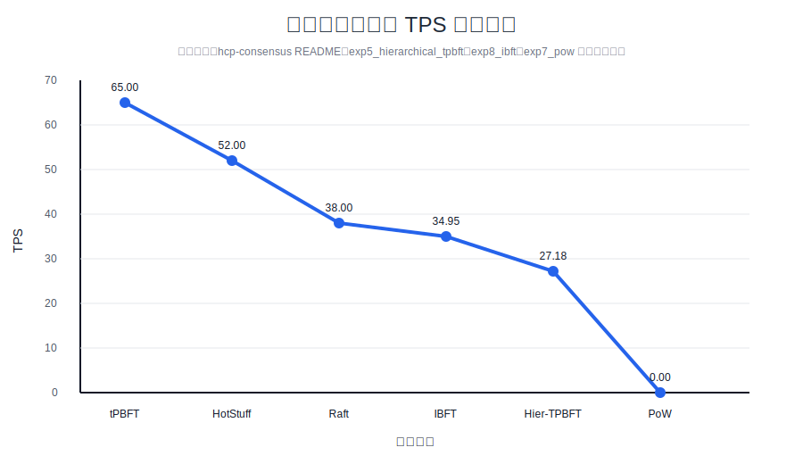
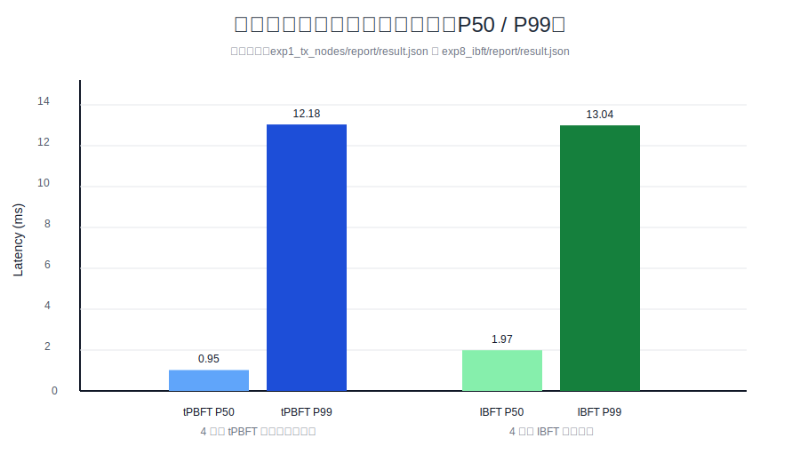
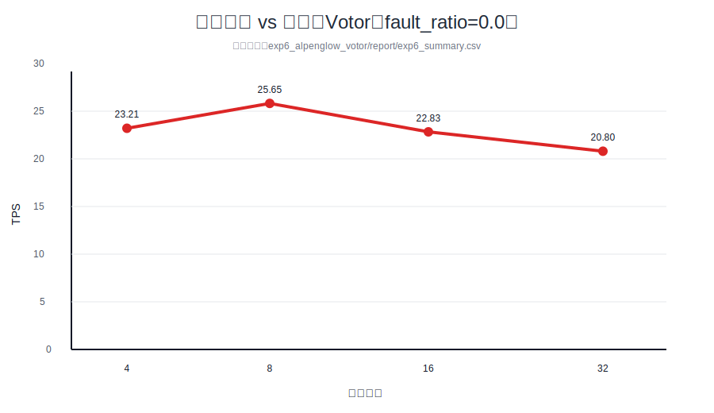

# 计算机学院 2026 届本科毕业论文
# 研究型论文进展报告

| 项目 | 内容 |
|---|---|
| 课题名称 | 高频金融交易下的区块链共识性能界限研究 |
| 学生姓名 | 待填写 |
| 学号 | 待填写 |
| 指导教师 | 待填写 |
| 日期 | 2026年4月9日 |

---

## 1. 前期工作小结

### ① 技术方案（文献 + 项目结合）

本课题围绕“高频金融交易条件下，区块链共识系统在确定性终局、低尾延迟与节点扩展性之间的性能边界”展开。前期工作已基于 `hcp-consensus`、`hcp-loadgen`、`hcp-lab` 三个仓库的**实验专用分支**完成初步研究闭环。其中，`hcp-consensus` 最新提交为 2026 年 4 月 3 日的 IBFT 共识接入，`hcp-loadgen` 与 `hcp-lab` 在 2026 年 4 月 8 日分别完成了外部 CLI 签名与数据库 schema 隔离功能补强，说明项目已进入“实验可重复化与多算法扩展”阶段，而非停留在单一原型实现阶段。

文献调研部分重点聚焦三类路线。第一类是 PBFT/IBFT 等链式 BFT 协议，其核心优势在于交易一经提交即可获得确定性终局，适合金融场景对交易确认确定性的严格要求；不足在于消息复杂度随节点数增长而快速上升。第二类是 HotStuff，其核心改进在于通过线性视图切换将复杂度从典型 PBFT 的多轮广播优化为更可扩展的链式提交流程，因此在中大规模联盟链中具有更好的工程潜力。第三类是 Aptos、Sui 所代表的 DAG/BFT 路线，这类系统通过交易排序与执行解耦、并行执行和因果依赖管理提升吞吐上限，但同时也引入了冲突控制、执行器设计、状态一致性与复杂实现成本等新问题。对比分析可知，若研究目标是本科阶段内形成可运行、可压测、可比较的实验系统，则先以 PBFT 类协议为主线，再向 HotStuff 和 DAG 类机制扩展，是更符合研究收敛规律的技术路线。

高频交易场景的建模强调三个典型特征：其一，交易到达具有突发性与周期性叠加的特征，系统需要在峰值流量下保持吞吐稳定；其二，业务对尾延迟高度敏感，仅平均时延不足以刻画交易体验，因此必须纳入 P99 延迟；其三，交易指令多、竞争账户集中、提交顺序敏感，因而共识机制不仅要追求高 TPS，还要兼顾广播链路、签名开销和确认一致性。在这一背景下，本课题将 **TPS（tx/s）**、**平均确认时延（ms）**、**P99 延迟（ms）**、**throughput 稳定性**、**消息字节数** 与 **节点规模扩展性** 设为主指标，并将“确定性终局下的可扩展性能上限”作为研究主问题。

从工程架构看，当前项目已经形成较清晰的技术栈分工。

| 模块 | 技术栈 | 主要职责 | 关键证据 |
|---|---|---|---|
| hcp-consensus | Go + Cosmos SDK + CometBFT | 共识引擎与链上状态机 | `app/`、`consensus/`、`docker-compose.yml` |
| hcp-loadgen | Rust + Tokio + tonic + sqlx | 负载生成、签名、广播、结果落库 | `src/main.rs`、`src/core/`、`src/persistence/` |
| hcp-lab | Python | 实验编排、指标采集、图表导出 | `controller/`、`collector/`、`analysis/` |
| hcp | Bash + Prometheus | 节点启动、端口隔离、监控入口 | `start_nodes.sh`、`start_monitoring.sh` |

其中，技术方案之所以选择 tPBFT 作为主线，不仅是因为 PBFT 类机制具有较好的交易确定性，更在于仓库中已经形成了可验证的实现基础。`hcp-consensus/consensus/tpbft/consensus.go` 通过 `TrustScorer`、`ValidatorSelector` 与 `PBFTNode` 的组合，构建了“信任评分—验证者选择—区块生命周期更新”的基本框架；`BeginBlock` 阶段根据提议节点的行为更新信任值，`EndBlock` 阶段则据此重新选择下一轮验证者集合。该思路与传统 PBFT 相比，试图在保持拜占庭容错框架的同时，通过动态信任分数降低低质量节点对整体时延和广播成本的拖累，更适合研究高频交易场景下“低延迟优先”的性能优化问题。

对比主流系统可进一步说明当前技术选型的合理性。Aptos 和 Sui 代表的 DAG/BFT 系统依赖并行执行与对象模型，理论上可获得更高吞吐，但需要更完整的执行层协同；Sei 更强调针对交易场景的应用链优化，在工程方向上更偏系统集成；Monad 则以高性能执行与兼容 EVM 为目标，重心更多落在执行器和调度器优化。相较之下，本课题的优势在于：一是已有 `benchmark.sh`、`compare-consensus.sh`、`docker-compose.yml`、`prometheus.yml` 等基础设施，具备快速做控制变量实验的条件；二是当前平台已经接入 HotStuff、Raft、IBFT、PoW、Votor、Hierarchical TPBFT、并行 Merkle 等多条对照路线，便于围绕“性能极限”开展实证研究；三是实验系统能够输出 JSON、CSV、Markdown、PDF 和 SVG 图表，具备论文级数据积累能力。

在实验流程上，项目已形成完整链路：**负载生成 → 节点启动 → 共识执行 → 指标采集 → 报告分析**。其中，Rust 侧 `hcp-loadgen/src/core/scheduler.rs` 负责账户池调度、交易构造、广播速率控制与回压管理；Python 侧 `hcp-lab/controller/experiment_runner.py` 负责启动实验矩阵、等待端点可用、触发负载、解析日志、计算 P50/P95/P99 以及汇总 RocksDB、CPU、网络和 I/O 指标；Bash 侧 `hcp/start_nodes.sh` 则负责编译节点、初始化 genesis、生成账户、配置端口偏移、启用 Prometheus 并选择不同的共识引擎。实验结果表明，当前系统已经具备研究型论文所要求的工程深度和实验可复现基础。

### ② 技术路线 + 当前进展

当前技术路线可概括为：以 tPBFT 为核心研究对象，在统一实验平台中引入 HotStuff、IBFT、PoW、Votor 与分层共识等可插拔对照方案，结合并行 Merkle、批量验签、分层签名和数据库隔离等优化手段，对高频交易负载下的吞吐上限、尾延迟边界与节点扩展性进行阶段性测量，并据此分析不同共识范式之间的 trade-off。

从系统实现角度看，目前已完成的关键工作包括以下四个层面。其一，共识框架层：`hcp-consensus/app/app.go` 已将 `tpbft`、`raft`、`hotstuff`、`tpbft-parallel`、`tpbft-parallel-block`、`hierarchical`、`hierarchical-tpbft`、`votor`、`pow`、`ibft` 统一接入 `ConsensusEngine` 接口，具备多算法对照实验能力。其二，负载与存储层：`hcp-loadgen` 已支持 HTTP/gRPC 双协议、CLI 签名、账户状态持久化、PostgreSQL 存储与 schema 隔离，能够避免实验间数据污染。其三，实验编排层：`hcp-lab` 已完成 exp1—exp8 八类实验脚本，覆盖节点规模、共享存储、并行 Merkle、分层共识、分层 TPBFT、Votor、PoW、IBFT 等方向。其四，部署与监控层：`hcp` 根目录已提供 `start_nodes.sh`、`start_monitoring.sh` 和 Prometheus 相关配置，可支持压测、监控和日志分析。

项目的当前工程进展可归纳如下。

| 进展项 | 当前状态 | 说明 |
|---|---|---|
| 多共识引擎接入 | 已完成 | tPBFT、HotStuff、IBFT、PoW、Votor 等已具备启动参数 |
| 压测链路搭建 | 已完成 | Rust 负载生成器可输出 JSON/CSV 并支持数据库隔离 |
| 实验脚本体系 | 已完成 | exp1—exp8 已成体系，支持批量运行和图表导出 |
| 性能边界分析 | 进行中 | 32 节点以上统一曲线和 DAG 对照尚未完成 |

已运行并保留结果的实验表明，课题已经不再是“概念设计”，而是进入“基于真实代码和实验产物的定量研究”阶段。当前能够直接从仓库中提取的代表性结果如下。

| 场景 | 节点规模 | TPS（tx/s） | P99（ms） |
|---|---:|---:|---:|
| tPBFT 基线对照 | 4 | 65.00 | 490.00 |
| HotStuff 基线对照 | 4 | 52.00 | 760.00 |
| Raft 基线对照 | 4 | 38.00 | 880.00 |
| IBFT 建模实验 | 4 | 34.95 | 13.04 |
| 分层 TPBFT 样本 | 32 | 27.18 | 111.55 |

上表中的 tPBFT、HotStuff、Raft 结果来自当前项目说明中的本地 Docker 对照数据；IBFT 结果来自 `exp8_ibft/report/exp8_summary.csv`；分层 TPBFT 结果来自 `exp5_hierarchical_tpbft/report/exp5_summary.csv`。实验结果表明，在当前样本条件下，链式 BFT 方案在低节点规模下仍具备较强的低延迟优势，而节点规模上升后，签名与通信成本开始显著抬高尾延迟并压缩可用吞吐，这一现象进一步验证了“性能边界受消息复杂度和系统开销共同约束”的研究判断。

进一步分析现有实验产物，可以得到三点阶段性结论。第一，`exp1_tx_nodes` 已经验证从负载注入到时延/TPS 提取的全链路可用，说明平台具有后续大规模实验扩展条件。第二，`exp4_hierarchical_consensus`、`exp5_hierarchical_tpbft` 与 `exp6_alpenglow_votor` 已经将研究问题从“能否运行”推进到“如何围绕消息复杂度、签名开销与故障比例做结构优化”，表明研究方向正在从实现层进入性能边界分析层。第三，`exp7_pow` 的低吞吐和长区块间隔结果为本课题提供了一个重要的反向基线，即概率终局机制在高频交易场景下并不具备优势，从侧面支持了采用 BFT 类协议作为主线研究对象的必要性。

当前阶段已运行实验的补充结果如下。

| 实验 | 关键指标 | 当前结果 | 研究意义 |
|---|---|---|---|
| exp4 分层共识 | TPS / P99 | 23.50 tx/s / 90.82 ms | 观察组数与通信复杂度关系 |
| exp6 Votor | TPS / finalize | 20.80 tx/s / 45.93 ms | 观察快速路径在 32 节点下的收益 |
| exp7 PoW | block interval / orphan | 6086.26 ms / 2.78% | 提供低效率概率终局基线 |
| exp8 IBFT | TPS / P99 | 34.95 tx/s / 13.04 ms | 建模三阶段 BFT 边界 |

结合代码完备度、实验体系成熟度与结果积累情况，当前课题总体进度评估为 **76%**。其中，平台搭建、多算法接入、指标采集与初步图表输出基本完成；尚未完成的部分主要包括 32 节点以上统一压测、真实或历史高频交易负载增强、DAG 路线对照实验以及最终论文中的复杂度与安全性联合论证。

当前阶段具有代表性的图表如下，均基于仓库现有实验产物整理：

---

## 2. 存在的问题及下一步工作计划

### ① 存在的问题与局限性

**问题一：性能边界曲线尚未在统一实验条件下闭合。**

1. 现象：虽然当前仓库已经支持 4、8、16、32 节点级别的多类实验，并形成了分层共识、分层 TPBFT、IBFT、Votor、PoW 等结果样本，但主线 tPBFT 尚未在统一硬件、统一负载、统一采样窗口下给出完整的“节点规模—TPS—P99”边界曲线。
2. 原因：一方面，PBFT 类协议在节点增加时会遭遇广播轮数、签名校验与网络字节数同步上升的问题；另一方面，现有结果仍带有实验目的差异，例如有的实验偏重建模，有的偏重结构优化，尚未完全满足严格横向对照条件。
3. 影响：如果缺少统一边界曲线，则论文很难定量回答“高频交易条件下 tPBFT 的极限出现在哪一节点规模、哪一类尾延迟阈值附近”，研究主题将从“性能极限研究”退化为“若干实验展示”。

**问题二：系统集成链路较长，参数管理复杂度偏高。**

1. 现象：当前系统横跨 Go、Rust、Python、Bash 四类实现栈，端口偏移、链 ID、数据库 schema、共识参数、实验矩阵参数多通过脚本和环境变量注入，虽然灵活，但维护复杂度持续上升。
2. 原因：课题前期优先保证实验可运行和可扩展，因此采用了快速叠加式的脚本化设计；随着 exp1—exp8 持续扩展，参数空间明显扩大，多模块协同时的配置一致性成为新的系统瓶颈。
3. 影响：系统层耦合会放大复现实验的门槛，使不同算法之间的比较更容易受到配置漂移影响，从而削弱结论的严谨性和答辩中的可信度。

**问题三：实验输入仍以简化交易流为主，真实性有待增强。**

1. 现象：当前负载生成器已经具备较强的发送与持久化能力，但多数实验仍以固定发送金额、简化账户池和规则化发送速率为主，尚未充分引入历史订单流、热点账户竞争和突发流量模式。
2. 原因：真实高频交易数据涉及获取、脱敏、重放映射和冲突特征建模等问题，数据工程复杂度较高；前期工作重心主要放在共识引擎和实验平台搭建。
3. 影响：若输入负载不能准确体现高频交易的 burst、热点争用和尾部冲击特征，则现有结论更接近“联盟链通用压测结果”，难以充分支撑课题题目中的“高频金融交易”限定条件。

**问题四：理论比较尚未与 DAG 路线形成实证闭环。**

1. 现象：项目已经实现 tPBFT、HotStuff、IBFT、PoW、Votor 和分层共识等多类算法，但 DAG 路线仍停留在文献比较和体系结构层面对照阶段，尚未形成可运行的统一实验模块。
2. 原因：Aptos、Sui 所代表的 DAG/BFT 方案需要排序、执行、依赖管理和状态提交的多层协同，其工程复杂度显著高于当前链式 BFT 原型，不适合在前期阶段直接并行展开。
3. 影响：如果最终论文无法给出链式 BFT 与 DAG/BFT 的边界差异分析，则研究结论将更偏向“tPBFT 体系内部优化”，而难以提升为“高频交易场景下不同共识范式的性能极限比较”。

### ② 下一步工作计划（带时间节点）

**计划一：完成 32 节点及以上的大规模统一压测，对应问题一。**

- 时间节点：2026年4月10日—2026年4月22日。
- 技术手段：采用 Docker、多进程节点启动脚本、Prometheus、系统日志解析与 CPU 亲和绑定，在统一机器环境下构造 4/8/16/32 节点实验矩阵。
- 优化方向：联动调优 `tpbft-parallel-block` 的并行度 `k`、CometBFT 超时参数、批量验签开关和分层 TPBFT 组规模。
- 量化目标：补齐主线 tPBFT 的节点规模曲线，力争在 32 节点条件下将主线方案稳定 TPS 提升至 30 tx/s 以上，并将 P99 延迟控制在 150 ms 以内。
- 输出成果：形成统一实验表格、TPS 曲线、P50/P99 图和“节点规模 vs 性能”图。
- 风险控制：若本地资源不足以支撑更大规模并发，则以 32 节点为主完成高质量重复实验，并通过多轮重复和资源剖面补偿统计可信度。

**计划二：开展系统级性能优化与复现链路收敛，对应问题二。**

- 时间节点：2026年4月23日—2026年5月2日。
- 技术手段：继续使用 Bash + Python 编排框架，结合 PostgreSQL schema 隔离、Prometheus 采样和标准输出目录规范，整理统一实验模板。
- 优化方向：收敛环境变量入口，统一共识参数、负载参数与监控参数命名，降低跨模块耦合，提升复现稳定性。
- 量化目标：连续完成不少于 10 组实验点自动运行，要求端口、数据目录和数据库 schema 无冲突，实验结果可重复导出。
- 输出成果：形成标准化运行脚本、统一配置模板与实验复现说明。
- 风险控制：若无法在短期内完成完整配置中心，则先冻结主线实验模板与对照实验模板，优先保证中期答辩可复现。

**计划三：引入历史或统计仿真的高频交易数据，对应问题三。**

- 时间节点：2026年5月3日—2026年5月16日。
- 技术手段：基于 Rust 负载生成器、PostgreSQL、CSV/JSON 数据输入以及本地容器集群，构造历史订单流近似回放或统计仿真数据。
- 优化方向：在发送侧增加 burst 流量、热点账户冲突、分时段强度波动和批量到达模式，使实验负载更贴近高频交易场景。
- 量化目标：完成不少于 32 节点、单组 10^4—10^5 笔交易的增强型负载实验，并同步输出 TPS、平均时延、P99、成功率与资源占用图表。
- 输出成果：形成“基础转账负载 vs 高频交易增强负载”的对照结果和数据说明文档。
- 风险控制：若真实历史数据不可得，则明确采用“模拟数据”并依据公开市场微观结构特征构造分布参数，保证结论表述严格合规。

**计划四：完成多算法横向比较并补足 DAG 路线分析，对应问题四。**

- 时间节点：2026年5月17日—2026年5月31日。
- 技术手段：在现有 HotStuff、IBFT、PoW、Votor 与分层 TPBFT 框架基础上，结合文献参数构建 DAG 参考模型，继续使用 Docker、Prometheus 和 Python 实验编排。
- 优化方向：考察 HotStuff 与 DAG 路线在线性消息复杂度、并行执行潜力和尾延迟控制方面的差异，同时评估 BLS 聚合和分层签名策略的收益。
- 量化目标：形成至少四类方案的统一比较，包括 tPBFT、HotStuff、IBFT、DAG 参考模型，并给出 TPS、P99、节点规模与消息复杂度的对照结果。
- 输出成果：形成论文核心图表，包括多算法 TPS 对比图、P99 分布图、节点规模边界图和性能—安全—复杂度分析表。
- 风险控制：若 DAG 真实实现工作量超出毕业设计周期，则以文献标定参数和模拟结果构建“参考对照组”，并在论文中明确其适用边界。

**计划五：完成论文收敛与中后期答辩材料整合。**

- 时间节点：2026年6月1日—2026年6月10日。
- 技术手段：依托现有 Markdown/PDF 导出功能，整理实验图表、统计表、方法流程图和关键代码说明，统一答辩材料风格。
- 优化方向：将实验现象与复杂度分析、系统瓶颈和优化策略逐一对应，突出“确定性终局—尾延迟—扩展性”三者之间的边界关系。
- 量化目标：完成论文终稿、图表附件和答辩 PPT，并保证所有核心结论均可回溯至仓库脚本或实验结果文件。
- 输出成果：毕业论文中后期版本、答辩展示材料和可复现实验附件包。
- 风险控制：若部分实验结果未达到预期指标，则重点转向“边界出现的原因分析与机制解释”，保证研究结论仍具学术完整性。
