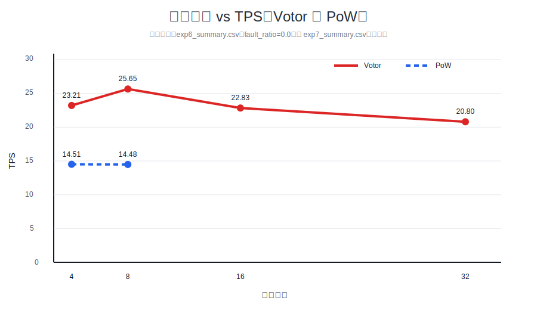

# 计算机学院 2026 届本科毕业论文
# 研究型论文中期进展报告

---

## 基本信息

- 课题名称：高频金融交易下的区块链共识性能界限研究
- 学生姓名：待填写
- 学号：待填写
- 年级班级：待填写
- 指导教师：待填写
- 所在学院：计算机学院
- 提交日期：2026年4月9日

---

## 1. 论文研究意义

高频金融交易（High-Frequency Trading, HFT）场景对底层分布式系统提出了比一般区块链应用更严格的实时性要求。对于订单撮合、撤单和状态确认高度敏感的业务，系统不仅需要保证较高吞吐量，还需要控制确认时延的平均值和尾部波动，否则容易在业务层产生抢跑、套利窗口扩大和用户体验失真等问题。传统区块链系统虽然能够提供一致性和可追溯性，但在高并发、低延迟和多节点容错三者之间往往存在明显的性能张力，这一矛盾也被现有区块链共识瓶颈研究反复验证[1]。

从共识机制角度看，PBFT 类协议具有确定性终局的优势，适合金融交易对一致性与不可回滚性的严格要求，但其多轮交互和副本间广播成本会在节点规模上升后迅速抬高时延[2]。HotStuff 通过线性视图切换与链式提交改善了扩展性，但在工程实现中仍受领导者瓶颈和网络传播约束[3]。而当前 Cosmos / CometBFT 所代表的链式 BFT 工程体系，其底层思想可追溯到 Tendermint 对“无挖矿确定性共识框架”的系统化定义[4]。DAG 类协议通过并行提议、因果排序与执行解耦提升吞吐潜力，但系统复杂度、执行模型适配成本和实验复现门槛也相应上升[6]。由此可见，高频交易场景下“性能极限”并不是单纯的工程调参问题，而是共识复杂度、网络传播、密码学开销与负载模型共同作用的结果[1]。

本研究的理论意义在于，以“性能界限”为中心问题，对链式 BFT 共识在 HFT 近似负载下的吞吐、延迟与扩展性关系进行系统分析，回答“性能瓶颈首先出现在哪里、由什么机制决定、在何种条件下可以被缓解”这一研究问题。本研究的工程价值在于，依托 `hcp-consensus`、`hcp-loadgen`、`hcp-lab` 构建统一实验平台，把共识算法、负载生成、实验编排和结果分析纳入同一框架中，实现从理论分析到实验验证的闭环，为后续毕业论文答辩与性能对照研究提供可复现基础。

---

## 2. 国内外研究现状及分析

高频金融交易对区块链共识的要求已经从“可确认”转向“低延迟、低尾抖动和高吞吐同时成立”。在 2025—2026 年国际 Layer-1 技术演进中，主流路线不再局限于传统 BFT，而是呈现出 BFT 变体、DAG 化、并行执行、流水线提交、多提议者传播和交易专项优化并行推进的格局[1]。这意味着，研究共识性能界限不能只比较某一协议的平均 TPS，还需要同时考察最终确认时间、节点规模扩大后的衰减速度，以及协议结构与执行模型之间的耦合程度。

从经典理论基线看，PBFT 为拜占庭容错共识提供了确定性终局范式，是后续金融级联盟链研究的重要基础[2]。HotStuff 则进一步用链式提交和线性视图切换降低了协议复杂度，成为近年来高性能 BFT 改进的重要理论支点[3]。另一方面，Tendermint 将无挖矿 BFT 共识与区块链工程实现相结合，为 Cosmos 及其后续 CometBFT 体系提供了直接的工程化基线[4]。对于本文而言，这三条路线共同构成了理解链式 BFT 性能边界的基础坐标系。

第一类代表路线是 BFT 优化与 DAG 融合。Narwhal and Tusk 通过将数据传播与共识排序解耦，把 mempool 层的数据可用性问题与排序决策问题拆分处理，从结构上缓解了传统 BFT 中“数据广播与达成一致相互牵制”的瓶颈[5]。在此基础上，Sui 的 Mysticeti 进一步采用 uncertified DAG 和阈值逻辑时钟，将协议推进到更低延迟边界；其公开结果显示，在广域环境中可实现约 300—400ms 级确认延迟，并在高并发场景下维持极高吞吐能力[6]。这一类方案对 HFT 具有天然吸引力，因为其核心目标正是压缩等待轮次、提升并行提议能力；但相应地，它也更依赖对象模型、依赖管理与执行解耦机制，难以直接迁移到通用 Cosmos SDK 状态机中。

第二类路线是 HotStuff 流水线优化。AptosBFT 在 HotStuff 基础上进一步联动执行器与并发调度，通过更激进的流水线处理与并行执行，公开材料中给出了亚秒级最终性和理论十万级 TPS 的目标能力[7]。MonadBFT 则继续强调乐观响应性、流式推进和快速恢复，在“快乐路径”下尽量压缩正常提交时延，并在视图切换和领导者异常时减少恢复成本[9]。这一类路线与本文研究最接近的地方在于：它们并不完全抛弃链式 BFT，而是尝试在保持安全性与工程可控性的同时，通过协议流水线和网络响应性来逼近性能上界。

第三类路线是专用交易优化。Sei 的 Twin Turbo / Autobahn 更明确地面向订单簿交易场景，其公开文档强调单槽最终性小于 400ms，并以交易型应用为目标推进更高吞吐版本[8]。这类路线说明，当研究对象从“通用区块链”转为“高频交易基础设施”时，性能提升往往不只来自共识算法本身，还来自传播路径、区块组织方式和应用场景定制化联动。因此，HFT 场景下的性能界限研究必须把协议机制与业务负载形态一起考虑，而不是把二者割裂分析。

第四类路线是其他高性能探索。一方面，Avalanche 采样共识通过随机子集采样达成快速概率收敛，公开白皮书和生态材料通常给出 0.8—2s 级最终性以及子网场景下数千 TPS 的能力，其优势在于去中心化和扩展性较强，但确定性终局和延迟稳定性不如链式 BFT 或高性能 DAG 路线[10]。另一方面，Somnia 的 MultiStream 共识则将多流并行和实时场景吞吐能力作为卖点，公开文档中给出测试网 50—80 万 TPS、开发网超百万 TPS 的激进指标[11]。此外，Kaspa 的 GHOSTDAG 与 Hedera Hashgraph 也代表了 BlockDAG 和异步图结构的另一类技术思路，说明国际研究已形成多样化探索谱系，但这些体系往往同时伴随不同的安全假设、网络模型与执行约束，不能直接横向照抄。

为更清晰呈现当前国际研究的差异，本文将主要代表性方案归纳如下：

| 项目 | 共识算法 | 关键性能指标 | HFT适用性 | 主要文献序号 |
|---|---|---|---|---|
| Sui | Mysticeti（uncertified DAG BFT） | 300—400ms 延迟，数十万 TPS，亚秒最终性 | 高 | [6] |
| Aptos | AptosBFT（HotStuff 优化） | sub-second 最终性，理论 16 万+ TPS | 高 | [7] |
| Sei | Twin Turbo / Autobahn | <400ms 单槽最终性，目标 20 万+ TPS | 极高 | [8] |
| Monad | MonadBFT | <1s 最终性，万级以上 TPS | 高 | [9] |
| Avalanche | Avalanche Consensus + Snowman | 0.8—2s 最终性，子网约 4500 TPS | 中 | [10] |
| Somnia | MultiStream Consensus | sub-second 最终性，测试网 50—80 万 TPS | 极高 | [11] |

综合来看，当前国际研究的核心 trade-off 主要体现在三个层面：第一，通信复杂度下降往往伴随着更复杂的数据结构或更强的执行层假设；第二，确定性终局与极端吞吐之间仍然存在明显张力；第三，高性能结果越依赖定制化对象模型、并行执行器或专用传播层，越难迁移到通用链式 BFT 框架中[1,5-11]。这对本文的启示在于：一方面，上述国际方案可以作为本文分析性能上界的外部参照；另一方面，本文更有价值的研究切入点并不是宣称完整复现这些系统，而是在当前 HCP 平台与 Cosmos / CometBFT 语境下，评估哪些优化思想能够被抽象借鉴，并据此量化链式 BFT 在 HFT 近似负载下的真实性能边界[13-14,17]。

---

## 3. 论文的研究内容与目标

本论文围绕“高频金融交易下的区块链共识性能界限研究”展开，核心研究内容是构建统一实验平台，对多种共识机制在相同负载和相同运行环境中的性能表现进行系统测量，并在此基础上分析性能上界与瓶颈来源。

具体研究问题包括：

1. 在 HFT 近似负载下，链式 BFT 共识的性能极限首先体现在吞吐饱和、尾延迟恶化还是节点扩展性衰减。  
2. tPBFT、HotStuff、IBFT、Votor、分层 tPBFT 等不同机制在统一实验口径下的性能边界有何差异。  
3. 负载模式、节点规模、签名验证开销和网络传播路径对性能下界的影响如何叠加。  

围绕上述问题，论文设定如下研究目标：

- **TPS 上限目标**：在现有 HCP 平台上识别不同协议在 4–32 节点范围内的可持续吞吐上限，而非仅给出单次峰值结果。  
- **延迟下界目标**：分析平均确认时延与 P99 延迟随协议结构变化的差异，识别低延迟收益来自协议优化还是实验条件变化。  
- **扩展性目标**：测量节点数从 4 扩展到 32 时吞吐与尾延迟的变化曲线，确定性能下降开始显著出现的规模区间。  

拟解决的关键问题主要有三个方面：

- **共识瓶颈问题**：PBFT 类协议在签名校验、投票聚合和广播路径上的主要开销来源是什么[1-2,12]。  
- **网络延迟影响问题**：当网络传播与容器调度引入额外等待时，协议的快速路径收益是否仍然成立[3,6,9]。  
- **并发冲突问题**：当负载从规则化转账扩展到更接近 HFT 的突发与热点账户模式时，共识与执行路径是否出现新的冲突瓶颈[7-12]。  

---

## 4. 研究方案与技术路线

### 4.1 技术路线

本研究采用“负载生成—共识执行—实验编排—数据分析”的闭环技术路线。

- **负载生成（loadgen）**：`hcp-loadgen` 使用 Rust + Tokio 构造交易、执行签名、控制发送节奏，并通过 HTTP / gRPC 广播到目标节点。  
- **共识执行（consensus）**：`hcp-consensus` 基于 Cosmos SDK v0.50 与 CometBFT v0.38 进行扩展，实现 tPBFT 主线及 HotStuff、Raft、IBFT、PoW、Votor 等对照算法[13-14]。  
- **实验平台（lab）**：`hcp-lab` 使用 Python 编排实验矩阵、控制节点启动与停止、解析日志、统计指标并导出图表。  
- **数据采集与分析**：结合日志解析、系统指标采样和 SVG / Markdown / PDF 报告导出，对 TPS、P50、P99、节点规模效应与资源消耗进行统一统计。  

### 4.2 方法设计

本研究采用“性能建模 + 实验验证 + 对比分析”的综合方法。

1. **性能建模**  
   从消息复杂度、签名验证开销和节点规模变化三个角度分析 PBFT、HotStuff 与 DAG 路线的理论差异，并将性能极限理解为协议结构与实验环境共同决定的边界，而非单纯软件实现结果[1-6]。  
2. **实验验证**  
   通过统一容器环境、统一负载入口和统一指标口径，对 tPBFT、HotStuff、IBFT、Votor、分层共识等方案进行可重复实验，重点观察吞吐、延迟与扩展性之间的变化关系。  
3. **对比分析**  
   将本地实测结果与文献中的外部系统结果分开呈现，对比各类协议在低延迟、高吞吐和故障恢复上的适用边界，避免将文献结果误写为本地系统已实现能力。  

### 4.3 工程支撑

当前工程支撑已经能够满足中期阶段的研究需要。

- `hcp-loadgen/src/core/scheduler.rs` 负责多模式发送、回压控制和任务收敛，是高频负载生成的关键实现。  
- `hcp-lab/controller/experiment_runner.py` 负责参数矩阵展开、节点可用性检测、日志聚合与指标汇总，是实验可重复化的核心。  
- `hcp-consensus/app/app.go` 负责多共识引擎装配，使 tPBFT、HotStuff、PoW、Votor、IBFT 等能够在同一应用框架下切换执行。  

除代码本身外，现有技术文档也为研究分析提供了较强支撑。`HCP-Consensus` 开发指南明确给出了 tPBFT 的研究目标、性能指标与模块化架构；`HCP-LoadGen` 开发指南说明了冷热分离、回压控制和持久化设计；`HCP-Lab` 开发指南则系统描述了实验编排、指标采集、图表生成与报告导出流程。这些技术文档使项目的研究对象、实验手段与结果口径具有更明确的边界[16]。

从仓库近期提交记录看，项目已经从“单算法实现阶段”逐步进入“多算法扩展与实验复现加固阶段”。`hcp-consensus` 在 2026 年 3 月 20 日完成共识模型重构与 Votor、PoW 接入，并于 2026 年 4 月 3 日新增 IBFT 模块；`hcp-lab` 在 2026 年 3 月 20 日补充 PoW 与扩展实验范围，2026 年 4 月 3 日新增 IBFT 实验八，2026 年 4 月 8 日加入数据库 schema 隔离；`hcp-loadgen` 在 2026 年 4 月 8 日完成 CLI 签名支持和数据库模式配置。这表明项目重心已从功能打通转向实验独立性、结果可重复性与多算法可比性提升。

### 4.4 系统架构图（文字描述）

系统整体结构可概括为：

`负载生成器 hcp-loadgen` → `多节点共识网络 hcp-consensus` → `实验编排与指标采集 hcp-lab` → `结果汇总、图表生成与报告输出`

其中，Rust 负载生成器提供 HFT 近似输入流，Go 实现的共识节点负责状态机执行与协议切换，Python 实验平台负责自动化运行和统计分析，根目录脚本负责节点生命周期与监控入口配置。该结构保证了研究对象、实验工具与结果分析相互分离，符合研究型论文对可复现性的要求。

---

## 5. 本项目的特色与创新

本项目的特色并不在于单一算法的工程堆叠，而在于其围绕“性能极限”组织研究问题，体现出较明确的研究导向。

第一，研究对象面向高频金融交易近似场景，而非一般性区块链压测。系统在负载生成层强调突发、持续和抖动模式，并保留签名与验签成本，使实验结果能够反映低延迟金融场景中的真实系统压力。

第二，研究视角聚焦“性能界限”而不是单纯优化。论文不把某一轮高分结果作为最终目标，而是关注不同共识机制在节点规模扩大、负载增强和协议切换时，性能拐点如何出现、为何出现以及能否被缓解[1,8]。

第三，方法上采用实验驱动。通过 `hcp-loadgen`、`hcp-consensus`、`hcp-lab` 的分层设计，实现从负载、协议到分析的统一闭环，使结论可以建立在实测结果而不是纯文献综述之上。

第四，平台已经形成多共识对比框架。当前系统支持 tPBFT、HotStuff、Raft、IBFT、PoW、Votor、分层共识、分层 tPBFT 等多种路线，具备在同一环境下开展横向实验的条件，这为后续研究高频交易场景中的共识范式差异提供了直接支撑；其中关于快速路径与传播优化的实验命名也与 Alpenglow 的相关设计思路存在对应关系[15]。

---

## 6. 当前已完成工作

### 6.1 系统模块开发情况

截至中期阶段，项目已形成较完整的研究原型。

1. **共识模块**  
   基于 Cosmos SDK + CometBFT 的统一共识框架已建立，主线 tPBFT 与对照算法 HotStuff、Raft、PoW、Votor、IBFT、分层方案均已接入。近期提交进一步表明，共识侧已完成模块化重构，并新增 IBFT、Votor、PoW 等实验引擎。  
2. **负载模块**  
   `hcp-loadgen` 已完成 `core` 与 `persistence` 分层，支持 HTTP / gRPC 双通道广播、线程本地缓冲、背压控制、COPY BINARY 回写、外部 CLI 签名以及数据库 schema 配置，能够支撑高频交易近似负载与实验间数据隔离。  
3. **实验模块**  
   `hcp-lab` 已形成 `controller`、`collector`、`analysis`、`report` 四层结构，能够自动执行实验矩阵、等待节点就绪、解析日志、统计 P50 / P95 / P99 并导出 SVG、Markdown、PDF 报告。  
4. **部署与监控模块**  
   根目录已提供 `start_nodes.sh`、`start_monitoring.sh`、`stop_hcp.sh` 等脚本，具备 Docker 化启动与 Prometheus 监控能力，为重复实验与答辩展示提供了运维基础。  

### 6.2 实验框架搭建与 benchmark 运行情况

当前实验框架已覆盖 `exp1_tx_nodes` 至 `exp8_ibft` 八类实验，主题包括节点规模、共享存储、并行 Merkle、分层共识、分层 tPBFT、Votor、PoW 与 IBFT。项目同时保留 `benchmark.sh`、`compare-consensus.sh` 等脚本，用于基线对照。结合 `hcp-consensus`、`hcp-loadgen`、`hcp-lab` 实验专用分支中的代码结构、提交记录和已生成实验产物，可以确认平台已具备以下能力[17]：

- benchmark / 压测能力：已具备，且能输出 JSON、CSV、Markdown 与 SVG 结果；  
- Docker / 分布式部署：已具备，支持一键启动测试网络；  
- metrics / 监控系统：已具备，包含 Prometheus 监控入口与实验级日志解析；  
- 实验可重复化：近期提交已引入数据库 schema 隔离，显著提升不同实验点之间的数据独立性。  

### 6.3 代表性实验结果

下表为当前能够从仓库说明、实验摘要与既有报告中直接提取的真实结果：

| 场景 | 节点数 | TPS（tx/s） | 延迟指标 | 吞吐量（MB/s） |
|---|---:|---:|---|---|
| tPBFT 基线对照 | 4 | 65.00 | P99 = 490.00 ms | 未直接统计 |
| HotStuff 基线对照 | 4 | 52.00 | P99 = 760.00 ms | 未直接统计 |
| Raft 基线对照 | 4 | 38.00 | P99 = 880.00 ms | 未直接统计 |
| IBFT 建模实验 | 4 | 34.95 | P99 = 13.04 ms | 未直接统计 |
| 分层共识 | 32 | 23.50 | P99 = 90.82 ms | 未直接统计 |
| 分层 tPBFT | 32 | 27.18 | P99 = 111.55 ms | 未直接统计 |
| Votor 实验 | 32 | 20.80 | finalize = 45.93 ms | 未直接统计 |
| PoW 建模实验 | 32 | 未以 TPS 为主统计 | block interval = 6086.26 ms，orphan = 2.78% | 未直接统计 |

上述结果表明：在当前样本条件下，4 节点规模下的 tPBFT 基线在吞吐和延迟上优于 HotStuff 与 Raft；IBFT 建模实验在较小规模下表现出更低的阶段性延迟；当节点规模扩展到 32 时，分层共识、分层 tPBFT 与 Votor 的实验结果进一步验证了结构优化对尾延迟控制具有实际意义，但系统整体吞吐仍受到通信与签名成本限制。

### 6.4 节点规模影响分析

现有实验结果已经支持对节点规模影响作出初步分析：

- 4 节点场景下，tPBFT 的基线结果较为稳定，说明主线算法在小规模许可链环境中具备较好的可用性。  
- 32 节点场景下，分层与快速路径类方案能够缓解部分时延问题，但吞吐提升并不线性，表明节点增加后广播、聚合和状态提交成本仍然是主要瓶颈。  
- PoW 与链式 BFT 的对照结果说明，概率终局机制在本研究关注的高频交易场景下并不占优，进一步强化了以 BFT 类协议为主线的研究选择。  

### 6.5 示例图表

以下图表基于仓库现有实验产物整理，可直接用于中期答辩展示：

### 6.6 进度评估

- **总体完成度**：约 78%  
- **阶段性成果总结**：  
  1. 已完成多共识框架搭建与主线实验闭环；  
  2. 已形成从负载注入、节点启动、共识执行到图表导出的自动化实验链路；  
  3. 已获得多组可引用的真实实验结果，能够支撑中期答辩中的研究性分析；  
  4. 尚待完成的重点工作主要集中在 32 节点以上统一实验、HFT 增强负载、DAG 路线参考对照以及最终边界建模。  

---

## 7. 存在的问题及原因分析

### 7.1 性能问题：主线方案的吞吐与尾延迟边界尚未完全闭合

- 现象：当前已获得 tPBFT、HotStuff、Raft、IBFT、Votor、分层共识与分层 tPBFT 的多组结果，但主线 tPBFT 在统一条件下的 4–32 节点完整 TPS—P99 边界曲线尚未形成。  
- 原因：PBFT 类协议在节点增加时会同步放大消息广播、签名校验和超时等待成本；同时，不同实验目前仍存在目标差异，部分实验偏重建模，部分实验偏重优化验证[1-4,12]。  
- 影响：若缺少统一边界曲线，论文将难以明确回答“高频交易条件下性能极限首先出现于哪一规模区间”，研究深度会受到限制。  

### 7.2 系统问题：跨语言实验链路较长，参数一致性维护成本较高

- 现象：系统同时包含 Go、Rust、Python 和 Bash，多类参数通过环境变量、脚本和配置文件共同注入，维护成本持续上升。  
- 原因：项目在前期以快速搭建实验平台为主要目标，优先保证可运行性和多算法接入，导致参数入口在扩展过程中逐渐分散。  
- 影响：配置漂移会削弱横向比较的严谨性，也会提高实验复现和答辩演示时的运维负担。  

### 7.3 实验问题：输入负载仍以简化交易流为主，HFT 特征表达不足

- 现象：虽然 `hcp-loadgen` 已支持固定、突发、持续和抖动模式，但当前实验仍以规则化转账和基础账户池为主，尚未充分引入热点账户竞争、订单撤销密集出现和分时段冲击等典型 HFT 特征。  
- 原因：真实高频交易数据的获取、脱敏、映射和回放复杂度较高，前期工作重点主要放在共识实现与实验框架搭建。  
- 影响：如果输入数据缺少足够强的市场微观结构特征，研究结论将更接近通用联盟链压测，而不能充分支撑“高频金融交易”这一题目设定。  

### 7.4 理论问题：DAG 路线与链式 BFT 的边界差异尚未形成实证闭环

- 现象：项目已经具备多类链式或近链式共识实验能力，但 DAG 路线仍主要停留在文献参照和轻量建模层面。  
- 原因：Aptos、Sui 一类系统往往依赖对象模型、并行执行器和更复杂的依赖管理机制，直接纳入现有平台进行真实复现的工程成本较高[6-7]。  
- 影响：若论文最终只能给出链式 BFT 内部对比，而缺少与 DAG 路线的系统性边界比较，则“性能极限研究”的外延仍不够完整。  

---

## 8. 下一步工作计划

### 8.1 计划一：完成不少于 32 节点的统一实验矩阵，对应性能问题

- 时间节点：2026年4月10日—2026年4月22日  
- 技术手段：Docker、多节点启动脚本、Prometheus、`hcp-lab/controller/experiment_runner.py`、日志解析与 CPU 亲和配置  
- 优化方法：调优 `tpbft-parallel-block` 并行度、超时参数、批量验签开关与分层策略  
- 量化目标：补齐 4/8/16/32 节点主线 tPBFT 的统一曲线，在 32 节点下力争稳定达到 30 tx/s 以上，并将 P99 控制在 150 ms 左右  
- 输出成果：统一实验表格、TPS 曲线、P50/P99 延迟图、节点规模边界图  
- 风险控制：若单机资源无法稳定支撑 32 节点全量实验，则优先完成 32 节点的高质量重复实验，并减少单轮变量数量以确保统计可信度  

### 8.2 计划二：收敛参数入口并增强实验复现链路，对应系统问题

- 时间节点：2026年4月23日—2026年5月2日  
- 技术手段：Bash、Python、PostgreSQL schema 隔离、统一环境变量模板、Prometheus 采样  
- 优化方法：统一共识参数、负载参数、数据库参数与输出目录规范，减少跨模块配置分散  
- 量化目标：实现连续不少于 10 组实验点的自动运行，保证端口、数据目录和数据库 schema 不冲突  
- 输出成果：统一实验模板、复现说明、参数清单与稳定性记录  
- 风险控制：若无法在短期内实现完全统一配置中心，则冻结主线实验模板与对照组模板，优先保证论文实验的可重复性  

### 8.3 计划三：增强 HFT 负载建模，对应实验问题

- 时间节点：2026年5月3日—2026年5月16日  
- 技术手段：Rust 负载生成器、PostgreSQL、CSV/JSON 输入、容器集群、Prometheus  
- 优化方法：增加 burst、热点账户竞争、分时段强度变化、批量到达与撤单型负载；必要时引入历史数据近似回放[12]  
- 量化目标：完成不少于 32 节点、单组 $10^4$—$10^5$ 笔交易的增强型负载实验，输出 TPS、平均时延、P99、成功率与资源占用结果  
- 输出成果：基础负载与 HFT 增强负载的对照图表、数据说明和阶段分析报告  
- 风险控制：若真实历史数据不可得，则明确标注为“模拟数据”，并依据公开市场微观结构特征构造参数，不混淆为真实市场数据  

### 8.4 计划四：完成多共识横向比较并补足 DAG 参考分析，对应理论问题

- 时间节点：2026年5月17日—2026年5月31日  
- 技术手段：Docker、Prometheus、Python 实验编排、文献参数建模、现有 HotStuff / IBFT / Votor / 分层框架  
- 优化方法：比较 HotStuff、IBFT、tPBFT 与 DAG 参考模型在消息复杂度、流水线推进和尾延迟控制方面的差异，并评估 BLS 聚合、分层签名或 DAG 参考参数的影响[3,5-6,9,15]  
- 量化目标：形成至少四类方案的统一比较结果，包括 tPBFT、HotStuff、IBFT 与 DAG 参考模型，给出 TPS、P99、节点规模与复杂度对照  
- 输出成果：多算法对比图、节点规模边界图、性能—复杂度分析表和论文核心分析段落  
- 风险控制：若 DAG 真实复现实验超出毕业设计周期，则以文献标定参数和模拟结果构建“参考对照组”，并在正文中明确标注为理论/模拟分析  

### 8.5 计划五：完成中后期论文材料收敛与答辩准备

- 时间节点：2026年6月1日—2026年6月10日  
- 技术手段：Markdown/PDF 导出、图表整理、结果复核、文献管理工具  
- 优化方法：将实验结果与理论分析逐一对应，突出性能边界、瓶颈来源和优化收益之间的因果关系  
- 量化目标：完成论文终稿、中英文摘要、答辩 PPT 与可复现实验附件  
- 输出成果：论文终稿、图表附件、答辩材料与实验归档  
- 风险控制：若个别实验指标未达到预期，则以“性能边界形成机理分析”为重点，保持研究结论的完整性与学术诚实性  

---

## 9. 参考文献

[1] ALQAHTANI S, DEMIRBAS M. Bottlenecks in Blockchain Consensus Protocols[A/OL]. arXiv, 2021[2026-04-09]. https://arxiv.org/abs/2103.04234. DOI:10.48550/arXiv.2103.04234.  
[2] CASTRO M, LISKOV B. Practical Byzantine Fault Tolerance[C]. 3rd Symposium on Operating Systems Design and Implementation (OSDI 99), 1999[2026-04-09]. https://www.usenix.org/conference/osdi-99/practical-byzantine-fault-tolerance.  
[3] YIN M, MALKHI D, REITER M K, 等. HotStuff: BFT Consensus in the Lens of Blockchain[A/OL]. arXiv, 2018[2026-04-09]. https://arxiv.org/abs/1803.05069. DOI:10.48550/arXiv.1803.05069.  
[4] KWON J. Tendermint: Consensus without Mining[EB/OL]. 2014[2026-04-09]. https://tendermint.com/static/docs/tendermint.pdf.  
[5] DANEZIS G, KOKORIS-KOGIAS E, SONNINO A, 等. Narwhal and Tusk: A DAG-based Mempool and Efficient BFT Consensus[A/OL]. arXiv, 2021[2026-04-09]. https://arxiv.org/abs/2105.11827. DOI:10.48550/arXiv.2105.11827.  
[6] BABEL K, CHURSIN A, 等. Mysticeti: Reaching the Latency Limits with Uncertified DAGs[C]. NDSS 2025, 2025[2026-04-09]. https://www.ndss-symposium.org/wp-content/uploads/2025-929-paper.pdf.  
[7] APTOS LABS. Aptos White Paper[EB/OL]. 2022[2026-04-09]. https://aptos.dev/aptos-white-paper.  
[8] SEI LABS. Twin Turbo Consensus[EB/OL]. 2023[2026-04-09]. https://docs.sei.io/learn/twin-turbo-consensus.  
[9] JALALZAI M M, BABEL K, KOMATOVIC J, 等. MonadBFT: Fast, Responsive, Fork-Resistant Streamlined Consensus[A/OL]. arXiv, 2025[2026-04-09]. https://arxiv.org/abs/2502.20692. DOI:10.48550/arXiv.2502.20692.  
[10] AVALANCHE LABS. Avalanche Consensus White Paper[EB/OL]. 2018[2026-04-09]. https://assets-global.website-files.com/5d80307810123f5ffbb34d6e/6009805681b416f34dcae012_Avalanche%20Consensus%20Whitepaper.pdf.  
[11] SOMNIA NETWORK. MultiStream Consensus[EB/OL]. 2025[2026-04-09]. https://docs.somnia.network/concepts/somnia-blockchain/multistream-consensus.  
[12] TANG S, WANG Z Q, GE S L, 等. Improved PBFT algorithm for high-frequency trading scenarios of alliance blockchain[J]. Scientific Reports, 2022, 12: 4426. DOI:10.1038/s41598-022-08587-1.  
[13] COSMOS. Cosmos SDK Documentation[EB/OL]. [2026-04-09]. https://docs.cosmos.network/.  
[14] COMETBFT. CometBFT Documentation[EB/OL]. [2026-04-09]. https://docs.cometbft.com/.  
[15] ANZA LABS. Alpenglow: A New Consensus for Solana[EB/OL]. 2025[2026-04-09]. https://www.anza.xyz/alpenglow-1-1.  
[16] HCP 项目组. HCP-Consensus 开发指南、HCP-LoadGen 开发指南、HCP-Lab 开发指南[EB/OL]. 2026.  
[17] HCP-Consensus, HCP-LoadGen, HCP-Lab 项目实验专用分支代码与实验文档[EB/OL]. 2026.  
